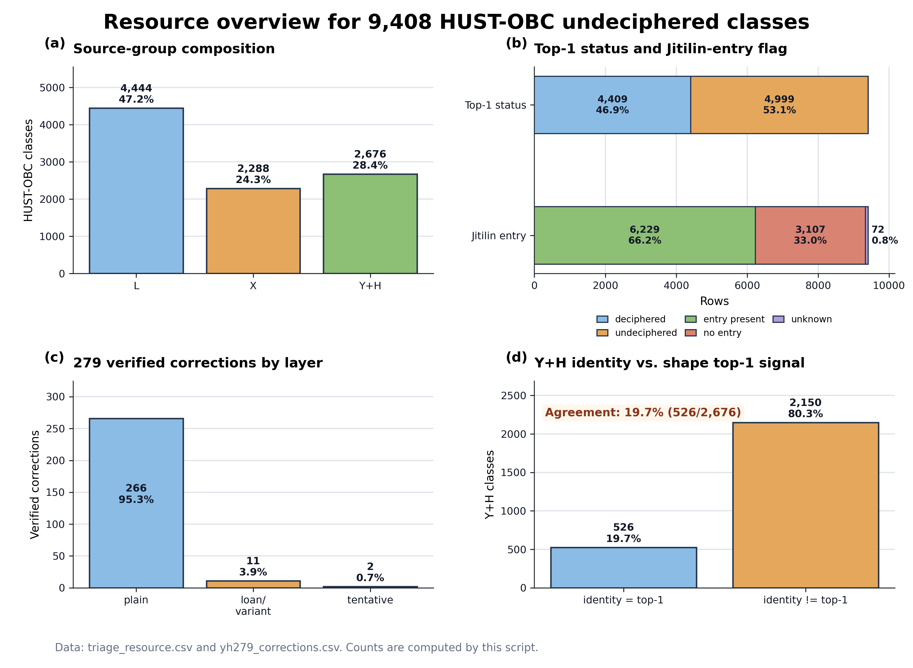

# A Triage-and-Audit Resource for the 9,408 Undeciphered Classes of HUST-OBC, with 279 Verified Metadata Corrections

**Authors**: Weiming Shen<sup>1</sup>

<sup>1</sup>Independent Researcher.

**Corresponding author**: Weiming Shen (19708110566@139.com; ORCID 0009-0006-8222-1668).

---

## Abstract

Of the ~4,500 attested oracle bone script (OBS) characters, roughly 3,000 remain undeciphered,
and recent machine-learning datasets — notably HUST-OBC — expose thousands of "undeciphered"
character classes as a natural target space for computational decipherment. We release a
**triage-and-audit resource** over all **9,408 undeciphered classes of HUST-OBC** that attaches
to each class, from the authoritative Yinqi Wenyuan platform, (i) its most shape-similar official
glyph code and that code's official reading and status, and (ii) whether the authoritative
compendium *Jiaguwenzi Gulin* (*Jitilin*) already contains a discussion entry for it. A
construction-guaranteed identity mapping additionally yields **279 verified metadata
corrections** — classes labelled "undeciphered" in HUST-OBC that in fact already carry an
official reading — each re-verified live against the platform API (279/279). The resource makes
explicit a property that is otherwise invisible: a majority of "undeciphered" classes are
*already discussed* in the literature, so the resource functions as a filtered target space that
separates genuinely-unclaimed characters from already-studied ones. All records are reproducible
from public, login-free endpoints; no copyrighted scans or fonts are redistributed.

---

## Background & Summary

The digitization of OBS has produced large labelled image datasets (HUST-OBC, HWOBC, OBC306)
that invite computational decipherment. A recurring but under-examined assumption is that a
dataset's "undeciphered" label marks a character as an open research target. It does not: the
label means only that no single consensus transcription exists, which is distinct from "not yet
studied." Many characters have been discussed — often with competing readings — for a century
without consensus. A pipeline that treats the whole undeciphered set as targets therefore wastes
effort re-deriving known arguments.

This resource operationalizes that distinction at dataset scale. For every one of the 9,408
HUST-OBC undeciphered classes we record two orthogonal official-code signals and a
discussion-presence flag drawn from the Yinqi Wenyuan platform, which digitizes the *Jitilin*
(a comprehensive exegetical compendium), the *Leizuan* concordance, and standard glyph
dictionaries. The resulting table lets any user (a) obtain, per class, the most shape-similar
known character and whether that character is itself deciphered, and (b) filter to classes with
*no* existing *Jitilin* discussion — the subset most likely to be genuinely unclaimed. As a
high-confidence by-product, a construction-guaranteed identity mapping over the `Y+H` classes
surfaces 279 classes whose "undeciphered" label is stale, providing an immediately actionable
dataset erratum. The resource's reuse value is thus twofold: a **prioritized, discussion-aware
target space** for decipherment research, and a **verifiable correction set** for dataset
maintainers.

**Key figures.** 9,408 classes (source groups: `L` 4,444, `X` 2,288, `Y+H` 2,676). Top-1
shape match is to a deciphered code for 4,409 classes and to an undeciphered code for 4,999.
A *Jitilin* entry exists for the top-1 match of 6,229 classes (66.7% of resolved lookups),
false for 3,107, and unresolved for 72 (API failure). 279 classes are verified metadata
corrections (266 plain readings, 11 loan/variant-annotated, 2 tentative).

---

## Methods

**Source datasets.** Glyph images and class labels are from HUST-OBC [ref, CC BY 4.0]. Official
readings, glyph codes, and exegetical cross-references are from the Yinqi Wenyuan platform
[ref], queried through its public, login-free endpoints (documented in the code repository).

**Shape-retrieval signal (all 9,408 classes).** A ResNet-18 encoder, fine-tuned on the 1,588
deciphered HUST-OBC classes (penultimate 512-d features), encodes each undeciphered class by
mean-pooling its variant images; cosine similarity against a gallery of rendered official glyphs
yields the top-1 official code and similarity per class. The encoder is a standard, replaceable
component; its held-out retrieval accuracy (Technical Validation) establishes the signal's
quality but is not itself a contribution.

**Constructive-identity signal (2,676 `Y+H` classes).** HUST-OBC `Y+H` directory names equal
the last five hexadecimal digits of official glyph codes (e.g. `Y+H/60007` → `U60007`). This
gives a by-construction (not similarity-inferred) mapping to the official code, its reading, and
its status. `X` and `L` names are source-book serials and have no such mapping.

**Discussion-presence flag.** For each relevant official code we query `getzxbybm` and record
whether the response links a *Jitilin* entry (`GLLX=1`). Requests are retried; unresolved codes
after retries are marked `unknown-if-fetch-failed`.

**Corrections set.** Classes whose constructive-identity code carries a nonempty official reading
while HUST-OBC labels them undeciphered constitute the 279 corrections; all were re-queried live
(279/279 returning the expected reading).

---

## Data Records



**Figure 1. Overview of the resource over 9,408 HUST-OBC undeciphered classes.**
(a) Source-group composition (L 4,444; X 2,288; Y+H 2,676). (b) Top-1 shape-match status
(deciphered 4,409 / undeciphered 4,999) and *Jitilin*-entry flag (entry present 6,229 = 66.2%;
no entry 3,107; unresolved 72). (c) The 279 verified corrections by reading type (plain 266;
loan/variant 11; tentative 2). (d) For the 2,676 Y+H classes, the constructive-identity code and
the shape top-1 code agree only 19.7% of the time, quantifying the font-vs-handwriting domain gap.
All counts are computed directly from the released tables.

The resource is deposited on Zenodo (DOI: 10.5281/zenodo.21290640) and comprises:

**1. `triage_resource.csv` / `.json` — 9,408 rows, one per undeciphered class.** Columns
(full definitions in `triage_resource_data_dictionary.md`):
`hustobc_class`, `source_group`; the constructive-identity group
`identity_official_code`, `identity_official_reading_jtz`, `identity_official_status`
(populated for `Y+H` only); the shape-retrieval group `top1_official_code`, `top1_similarity`,
`top1_official_reading_jtz`, `top1_official_status`, `top1_has_jitilin_entry`; and the flag
`is_verified_correction`.

**2. `yh279_corrections.csv` / `.json` — 279 rows.** The verified corrections subset, with
`id`, class, official code, reading, `reading_type` (plain / loan_or_variant / tentative),
evidence source, per-row reproduction URL, fetch date, and verifier.

**3. Provenance artifacts.** `triage_resource_api_cache.json` (per-code API responses and retry
outcomes), `triage_resource_summary.json` (construction metadata and aggregate counts), and the
deterministic builder script.

**Two signals, not to be conflated.** For `Y+H` rows the identity and shape signals are both
present and should be read separately: the identity code is authoritative; the top-1 code is the
independent shape signal. For `X`/`L` rows only the shape signal is available.

**Table 1. Composition and per-class signals across the 9,408 undeciphered classes.**

| Slice | Classes | Top-1 = deciphered | *Jitilin* entry present | Entry absent | Entry unresolved |
|---|---:|---:|---:|---:|---:|
| `L` (Liu source serials) | 4,444 | — | — | — | — |
| `X` (Xin source serials) | 2,288 | — | — | — | — |
| `Y+H` (code-derived) | 2,676 | — | — | — | — |
| **All classes** | **9,408** | **4,409 (46.9%)** | **6,229 (66.2%)** | **3,107 (33.0%)** | **72 (0.8%)** |

The *Jitilin*-entry share is 66.2% of all 9,408 classes, equivalently 66.7% of the 9,336
classes whose lookup resolved (excluding the 72 API failures). Slice-level status columns are
provided per row in the released table.

**Table 2. The 279 verified metadata corrections, by reading type.**

| Reading type | Count | Share | Meaning |
|---|---:|---:|---|
| Plain reading | 266 | 95.3% | Official code carries a direct modern-character reading |
| Loan / variant-annotated | 11 | 3.9% | Reading given with a 通假/异体 annotation |
| Tentative | 2 | 0.7% | Reading marked provisional on the platform |
| **Total** | **279** | **100%** | All re-verified live (279/279) |

---

## Technical Validation

**Corrections (279).** Precision rests on two independent guarantees rather than a statistical
estimate: (i) the identity mapping is exact by construction, and (ii) every entry was
re-verified against the live API (279/279 returned the expected reading on 2026-07-06). The set
was additionally submitted upstream to the HUST-OBC maintainers as an erratum
(https://github.com/Pengjie-W/HUST-OBC/issues/8).

**Shape-retrieval signal.** Held-out retrieval accuracy validates the top-1 shape signal: on
4,219 query images never seen in training (drawn from 891 classes), Top-1 is 84.7% (Wilson 95%
CI [83.6, 85.8]) and Top-10 95.5% ([94.9, 96.1]). A non-fine-tuned ImageNet ResNet-18 reaches
only 26.2% / 50.4%, and a random baseline ≈0.05%, confirming the signal is driven by domain
adaptation; across gallery sizes {4,8,16} and two pooling schemes, Top-1 stays within 80–89%
and Top-10 ≥94.8%.

**Discussion-presence flag.** Entry presence is reproducible and its aggregate is seed-robust:
across five random samples of 200 undeciphered codes, the *Jitilin*-entry rate is a majority in
every seed (55.5–71.5%, mean 63.2%), matching the whole-resource figure (66.7% of top-1 lookups).

**Documented divergence (a property, not an error).** For `Y+H` classes the identity code and the
top-1 shape code agree only 19.7% of the time, quantifying the domain gap between rendered
official fonts and handwritten/rubbing images. Users needing the authoritative code for `Y+H`
should use the identity columns; the shape columns provide an independent view.

**Known limitations.** (i) Page-image "discussion-depth" proxies (ink density, column count)
are exploratory and *not* validated against a ground-truth depth scale; all quantitative claims
here rest on binary entry *presence*, not depth. Rigorous depth validation requires expert
annotation and is left to future work. (ii) 72 classes have unresolved entry-presence (API
failure), flagged as such. (iii) Post-*Jitilin* corpora (e.g. Huayuanzhuang 2003) trivially
lack entries; users should stratify by attestation era before interpreting a `false` flag as
"undiscussed."

---

## Usage Notes

- **Prioritized target space.** To find likely genuinely-unclaimed characters, filter
  `top1_has_jitilin_entry == false` (and, for `Y+H`, `identity_official_status == undeciphered`),
  optionally excluding post-*Jitilin*-only attestations. Conversely, `is_verified_correction ==
  true` marks classes to relabel as deciphered.
- **Two-signal rule.** Never treat `top1_official_code` as the identity of a `Y+H` class; use
  `identity_official_code`. The two are deliberately separate.
- **Reproduction.** Every reading and flag is regenerable from the login-free endpoints
  documented in the repository; no copyrighted scans or fonts are included in the release.
- **Relationship to the methods paper.** The analysis motivating this resource (the pseudo-target
  problem, the discussion-depth triage framework, case studies) is reported in a companion methods
  manuscript, included as a preprint in the same data release (Zenodo DOI 10.5281/zenodo.21290640);
  this Descriptor documents the released data.
- **Minimal example (Python/pandas).** Load the resource and extract the highest-priority
  genuinely-unclaimed targets:

  ```python
  import pandas as pd
  df = pd.read_csv("triage_resource.csv")
  # Candidates with no existing Jitilin discussion (most likely truly unclaimed):
  unclaimed = df[df.top1_has_jitilin_entry == "false"]
  # Verified corrections to relabel as deciphered:
  corrections = df[df.is_verified_correction == True]
  # For Y+H classes, use the authoritative identity code, not the shape match:
  yh = df[df.source_group == "Y+H"]
  ```

---

## Data & Code Availability

Data package, builder, and companion preprint: Zenodo DOI 10.5281/zenodo.21290640;
release repository https://github.com/shenzxc/hustobc-triage-resource. Source materials remain
© their publishers; only character codes, page identifiers, readings, and reproduction URLs are
redistributed, under the platform's public-access terms; HUST-OBC images are reused under CC BY 4.0.

## References

*(BibTeX in `references.bib`; the journal template will format these. Core entries:)*

1. Wang, P. *et al.* An open dataset for oracle bone character recognition and decipherment.
   *Scientific Data* **11**, 976 (2024). https://doi.org/10.1038/s41597-024-03807-x
2. Li, B. *et al.* HWOBC — a handwriting oracle bone character recognition database.
   *J. Phys.: Conf. Ser.* **1651**, 012050 (2020).
3. Huang, S. *et al.* OBC306: A large-scale oracle bone character recognition dataset.
   *ICDAR* 681–688 (2019).
4. Guan, H. *et al.* Deciphering oracle bone language with diffusion models. *ACL* 15554–15567 (2024).
5. He, K., Zhang, X., Ren, S. & Sun, J. Deep residual learning for image recognition. *CVPR* 770–778 (2016).
6. Yu, X. (ed.). *Jiaguwenzi Gulin* (甲骨文字诂林), 4 vols. Zhonghua Book Company, Beijing (1996).
7. Yao, X. & Xiao, D. (eds.). *Yinxu Jiagu Keci Leizuan* (殷墟甲骨刻辞类纂), 3 vols. Zhonghua Book Company, Beijing (1989).
8. Li, Z. *Jiaguwenzi Bian* (甲骨文字编), 4 vols. Zhonghua Book Company, Beijing (2012).
9. Key Laboratory of Oracle Information Processing, Anyang Normal University. *Yinqi Wenyuan* platform. http://jgw.aynu.edu.cn/ (accessed 2026).
